# DirOpusReImagined

This is **DirOpusReImagined** - a modern cross-platform file manager inspired by the classic Amiga Directory Opus 4.12.

## What It Does

It's a **dual-panel file manager** built with .NET 8 and Avalonia that runs on Windows, macOS, and Linux. Think of it as a professional-grade file browser with two independent panels side-by-side for efficient file management.

## Key Features

### Dual-Panel File Browsing
- Two independent file panels displayed side-by-side for efficient file management
- Each panel has its own path bar, back button, and drive selector
- Double-click a folder to navigate into it; use the back button to go up a level
- Swap panel contents or clone one panel's path to the other with dedicated buttons

### Folder Tabs
- Each panel has its own row of **folder tabs** — open several folders per side and switch between them with a click
- **＋** opens a new tab cloning the current folder; each tab keeps its own path, back-history, sort, and filter
- Close a tab with its **×** or a **middle-click** (the last tab can't be closed); keyboard: **Ctrl/Cmd+T** new, **Ctrl/Cmd+W** close, **Ctrl/Cmd+Tab** / **Ctrl/Cmd+PageUp/Down** to cycle
- Open tabs are **remembered across restarts** (saved to `Configuration.xml`); paths that no longer exist are dropped on load

### File Operations
- **Copy** files and folders between panels
- **Move** files and folders between panels
- **Delete** files and folders with a confirmation dialog — deletes go to the **OS trash / recycle bin** by default (recoverable), with a per-delete toggle for permanent deletion (local files only)
- **Rename** files and folders with a pattern-based rename interface for batch operations
- **Create folders** in either panel
- **Create ZIP archives** from selected files
- **Drag and drop** selected items between panels (or onto a folder row); Copy by default, hold **Shift** to Move

### Directory Compare & Sync
- **Compare panels** — a **Cmp** button color-codes the two panels against each other: green = only on this side, blue = newer, gray = older, khaki = same time but different size, coral = couldn't be read (permissions)
- Comparison is **recursive** — a folder that looks identical at the top level but differs deep inside is still flagged; click **Cmp** again (or navigate) to clear
- **Content (hash) compare** — right-click **Cmp** to compare by MD5 hash instead of size + timestamp, catching files edited and re-saved at the same size and time
- **One-way sync / mirror** — **Sync→** and **Sync←** bring the destination up to date with the source, copying only new, newer, and changed items and never overwriting a newer destination file; an opt-in **mirror** mode also deletes items that exist only in the destination
- **Two-way "newer wins" sync** — the **⇄** button merges both panels in both directions, copying each file's newer version to whichever side is older or missing; nothing is deleted and same-time/different-content files are left as conflicts
- Sync is **recursive and file-level**, reuses the transfer progress dialog (current file, speed, ETA, cancel), and works for local, cloud, and cross-provider paths
- Right-click either **Sync** button (or **⇄**) for a content (hash) variant; long compares run behind a modal dialog with a live "current folder" line and a **Cancel** button

### Real-Time Filter
- Each panel has a filter text box that narrows the displayed files and folders as you type
- Filters by name using case-insensitive matching
- An X button next to each filter clears it instantly
- Filters reset automatically when navigating to a new directory

### Status Bar
- A status bar at the bottom of the window shows live information for each panel:
  - Total folder and file counts
  - Number of selected files and their combined size
  - Free disk space on the current drive

### Selection Management
- Click to select a single item; Ctrl+Click for multi-select; Shift+Click for range select
- Full keyboard selection: arrows single-select, Shift+arrows extend a range, Space/Insert mark-and-advance (see **Keyboard Navigation & Shortcuts**)
- **Wildcard selection** — Select or Deselect items by a pattern (e.g. `*.jpg`, `proj*`), or Invert the selection, from the right-click menu or the **+** / **-** / **\*** keys; respects an active filter and offers a Files-only option
- "Select All" buttons to select all files (not folders) in a panel
- "Clear" buttons to deselect everything in a panel

### Keyboard Navigation & Shortcuts
- The panel with keyboard focus is the **active panel**, shown with a highlighted frame; click a panel or press **Tab** to switch between them
- A keyboard **cursor** (the outlined row) is moved with the arrow keys, independent of the mouse:

| Key | Action |
|-----|--------|
| **↑ / ↓** | Move the cursor and single-select that row (Explorer-style) |
| **Page Up / Page Down** | Move a screenful at a time |
| **Home / End** | Jump to the first / last item |
| **Ctrl/Cmd + ↑ / ↓** | Move the cursor **without** changing the selection |
| **Shift + ↑ / ↓ / Home / End / Page** | Extend a contiguous selection from the anchor |
| **Space / Insert** | Toggle the cursor row's selection, then advance one row |
| **Ctrl/Cmd + A** | Select all files in the active panel |
| **Enter** | Open the cursor row — folders navigate in, files open/execute |
| **Backspace** | Go up one directory level in the active panel |
| **Alt + ← / →** | Back / Forward in the panel's history |
| *(type a name)* | Type-ahead: jump to the matching row; repeat a letter to cycle |
| **Tab** | Switch the active panel |
| **F2** | Rename the selection in the active panel |
| **F3** | View the selected file (text/hex), including files inside archives |
| **F5** | Copy the selection from the active panel to the other panel |
| **F6** | Move the selection from the active panel to the other panel |
| **F7** | Create a new folder in the active panel |
| **F8** or **Delete** | Delete the selection in the active panel |
| **+** | Select items by a wildcard pattern (e.g. `*.jpg`) |
| **-** | Deselect items by a wildcard pattern |
| **\*** | Invert the selection |
| **Ctrl/Cmd + T** | New folder tab (clones the current folder) |
| **Ctrl/Cmd + W** | Close the active tab |
| **Ctrl/Cmd + Tab** | Cycle to the next tab (Shift for previous) |
| **Ctrl/Cmd + PageUp / PageDown** | Previous / next tab |

- Copy/Move always flow **out of** the active (framed) panel into the other one, so Tab-then-F5 reverses the direction
- Typing in the path or filter boxes is never intercepted — the shortcuts only act while a file panel has focus

### 36 Customizable Action Buttons
- A grid of 36 user-configurable command buttons below the panels
- Each button can launch any external program with flexible argument substitution
- Supports parameter placeholders like `%FD%`, `%LPATH%`, `%AF%`, and more
- Button appearance (color, text, alignment, tooltip) is fully configurable via XML

### Bookmarks
- A **Bookmarks** button in the center panel opens a dialog listing your saved folders
- Send any bookmark to the **Left** or **Right** panel, add the current folder of either panel, or remove entries — all following the active Light/Dark theme
- Persisted to `BOOKMARKS.MD` beside the executable as a plain-Markdown list (`- [Name](path)`) that ships with the app and is easy to hand-edit
- Paths may be local or `cloud://<remote>/<path>`; on first run a default set is seeded — **Home, Root, Desktop, Documents, Pictures** — resolved for the current user and OS

### Open Terminal Here
- **Terminal Here** on each panel's right-click menu opens a terminal in that panel's current folder — no need to activate the panel first
- Cross-platform by default: Windows Terminal → PowerShell → cmd on Windows, Terminal.app on macOS, and the first available emulator on Linux (`x-terminal-emulator`, `gnome-terminal`, `konsole`, `alacritty`, `kitty`, and more)
- Override the terminal with a `<Terminal>` entry in `Configuration.xml`, editable from the **System Wide Settings** tab of the Button Configuration dialog; use `%DIR%` for the target folder. A failed custom command falls back to auto-detection

### Integrated Image Viewer
- Built-in image viewer for common formats (BMP, JPG, PNG, TIFF, GIF, ICO, etc.)
- Configurable via the `<UseIntegratedImageViewer>` setting

### File Viewer (Text / Hex)
- Press **F3** (or right-click → **View**) to open a read-only viewer for the selected file
- **Auto-detects** text vs binary and opens in the right mode; a **Text ⇄ Hex** toggle switches anytime (hex shows offset · bytes · ASCII)
- Reads through the same provider layer as everything else, so it views **files inside archives** just as easily as normal files
- Large files are capped (first 256 KB) with a truncation note so the viewer stays responsive

### Browse Into Archives
- Double-click a **.zip, .7z, .rar, .tar, or .tar.gz/.tgz** to open it like a folder and browse its contents (nested folders included)
- **Extract** by copying or dragging files/folders out to a normal folder — reuses the standard transfer progress and overwrite prompts
- **View** files inside archives with F3, and **open them in external tools** (custom command buttons) — the file is extracted to a temporary copy that the tool receives
- Archives are **read-only**: writing into one is blocked with a clear message (extract first, then modify); edits made in an external tool stay in the temp copy and are not written back
- Powered by [SharpCompress](https://github.com/adamhathcock/sharpcompress) — pure-managed, so it works on every supported platform

### Cloud Storage Access
- Browse Google Drive, OneDrive, Dropbox, S3, Box, and 40+ other providers via [rclone](https://rclone.org/)
- Access any configured remote with `cloud://<remote-name>/<path>` in the panel path box
- Automatic rclone download on first use, with live progress UI
- Lazy daemon startup — no overhead until you actually use cloud storage
- Dedicated diagnostics dialog showing binary location, configured remotes, live daemon log, and recent API requests

### Navigation
- Path text box with Enter key navigation
- **Back and Forward** buttons per panel (per-tab history) — Back also goes up a level; **Alt+← / Alt+→** on the keyboard
- Full keyboard navigation — arrow-key cursor, Enter to open, Backspace to go up, Tab to switch panels (see **Keyboard Navigation & Shortcuts**)
- **Type-ahead** — start typing a name in a panel to jump to the matching file/folder; repeat a letter to cycle
- Drive button for drive/volume selection
- Panel swap and clone buttons for quick path synchronization
- Cloud paths fully integrated alongside local — same double-click / breadcrumb / back behavior

### Display Options
- Toggle hidden file visibility with the "Show Hidden" checkbox
- **Sort by clicking a column header** — Name, Size, or Date; click again to reverse (an ▲/▼ shows the active column). **Right-click a header** for a menu with **Type (extension)** sorting and explicit Ascending/Descending. Sorting is per-panel and persists as you navigate; folders stay grouped first
- Configurable font sizes for grid content and headers
- Right-click context menu on panels — Calculate Folder Size, File Permissions, Copy Path / Full Path, **Terminal Here**, and font size adjustment
- Tooltips on hover showing file/folder details

### Theming
- A **Theme** selector in the center panel switches the whole app between **Light**, **Dark**, **System** (follow the OS), and the named palettes **Dracula**, **Nord**, **Solarized Light**, and **Solarized Dark**
- The choice is saved to `Configuration.xml` and restored on next launch; System mode tracks OS appearance changes live
- Themes the entire application — window chrome, every dialog, and both file grids — from a central set of semantic color tokens
- File-row text color is chosen per row for legibility (WCAG luminance) so selection, hover, and compare colors stay readable in both themes

### Built-in Help
- A **General Help** button opens a scrollable dialog listing the application's features and a full keyboard-shortcut reference

### Cross-Platform Support
- Runs on Windows, macOS, and Linux via Avalonia
- Platform-specific configuration files (Configuration.xml, MACConfiguration.xml, LINUXConfiguration.xml)
- Handles platform differences in path separators, special folders, and executable detection

### Configuration
- XML-based configuration file (`Configuration.xml`) for all customization
- Configurable executable file extensions for double-click launching
- Configurable image file extensions for the integrated viewer
- Per-panel start paths, font sizes, and titles

## Tech Stack

- **Framework**: Avalonia 11.0.0 (cross-platform UI)
- **Runtime**: .NET 8.0 / C#
- **XML-based configuration** for buttons and settings

The project is currently at version 0.1.19.0 and under active development. It's designed for power users, developers, and system administrators who need efficient file management with extensive customization options.

## Detailed Overview

The interface presents itself as two panels of files in a specified path.
The standard sorts of navigation allow one to move around the file system 
in each panel. There are also buttons to allow one to move up a directory 
to the left of each path text area above each panel.
Between the left and right panels is a button to allow one to copy and move
files and folders from one panel to the other. 

Doubkle clicking on a folder in a panel will open that folder in the same panel
adjusting the panels path text area accordingly.

To select a file simply click on it. To select multiple files hold down the
control key and click on the files you want to select. 

There are a series of buttons below the panels that allow one to user defined
functions. I first execution the application will read the definitions of these 
user defined functions from a file called `Configuration.xml` in the same folder.

A Sample of this file is shown below

```
<Settings>
	<Buttons>
		<Button>
			<Name>LPButton1</Name>
			<Content>VSCODE here</Content>
			<Background>Red</Background>
			<Foreground>Black</Foreground>
			<HorizontalAlignment>Center</HorizontalAlignment>
			<VeriticalAlignment>Center</VeriticalAlignment>
			<Margin>2,2,2,2</Margin>
			<Action>code</Action>
			<Args>%FD%</Args>
			<Shell>True</Shell>
			<Window>True</Window>
		</Button>
		<Button>
			<Name>LPButton2</Name>
			<Content>VSCODE All Files</Content>
			<Action>code</Action>
			<Args>%AF%</Args>
			<Shell>True</Shell>
			<Window>True</Window>
		</Button>
		<Button>
			<Name>LPButton3</Name>
			<Content>NotePad all seq</Content>
			<Action>notepad.exe</Action>
			<Args>%LAF%</Args>
			<Shell>False</Shell>
			<Window>False</Window>
		</Button>
		<Button>
			<Name>LPButton4</Name>
			<Content>Code Diff</Content>
			<Action>code</Action>
			<Args>--diff %LF1% %RF1%</Args>
			<Shell>True</Shell>
			<Window>False</Window>
			<ToolTip>Call VSCODE with the --diff parameter passing the first file selected in the Left and Right panel as arguments</ToolTip>
		</Button>
		<Button>
			<Name>LPButton33</Name>
			<Content>Windows Terminal on Left</Content>
			<Action>wt</Action>
			<Args>-d %LPATH%</Args>
			<Shell>False</Shell>
			<Window>False</Window>
			<ToolTip>Opens a windows terminal in the filder shown on the left panel</ToolTip>
		</Button>
		<Button>
			<Name>LPButton34</Name>
			<Content>Windows Terminal on Right</Content>
			<Action>wt</Action>
			<Args>-d %RPATH%</Args>
			<Shell>False</Shell>
			<Window>False</Window>
			<ToolTip>Opens windows terminal in the filder shown on the right panel</ToolTip>
		</Button>
		<Button>
			<Name>LPButton35</Name>
			<Content>Terminal on Left</Content>
			<Action>alacritty</Action>
			<Args>--working-directory %LPATH%</Args>
			<Shell>False</Shell>
			<Window>False</Window>
			<ToolTip>Opens an alacritty terminal in the filder shown on the left panel</ToolTip>
		</Button>
		<Button>
			<Name>LPButton36</Name>
			<Content>Terminal on right</Content>
			<Action>alacritty</Action>
			<Args>--working-directory %RPATH%</Args>
			<Shell>False</Shell>
			<Window>False</Window>
			<ToolTip>Opens an alacritty terminal in the filder shown on the right panel</ToolTip>
		</Button>
	</Buttons>

	<Executable>
		<Extensions>
			EXE,BAT,PS1,BMP,JPG,JPEG,TXT,PNG,TIFF,GIF,ICO,
			PNG,DOC,DOCX,XLS,XLSX,PPT,PPTX,PDF,ZIP,RAR,7Z,WAV,AAC,MP3,MP4,
			AVI,FLV,WMV,MOV,MPG,MPEG,FLAC,OGG,OGV,WEBM,HTML,HTM,XML,JSON,
			CSS,JS,TS,CS,CSHARP,CSHTML,ASPX,ASP,PHP,SQL,INI,CFG,LOG,MD,MARKDOWN
		</Extensions>
	</Executable>

	<Images>
		<ImageExtensions>BMP,JPG,JPEG,PNG,TIFF,TIF,GIF,ICO,PCX</ImageExtensions>
		<UseIntegratedImageViewer>False</UseIntegratedImageViewer>
	</Images>

	<LeftGrid>
		<FontSize>14</FontSize>
		<HeaderFontSize>16</HeaderFontSize>
		<Title>LEFT Grid</Title>
		<TitleFontSize>20</TitleFontSize>
		<StartPath>/</StartPath>
	</LeftGrid>

	<RightGrid>
		<FontSize>14</FontSize>
		<HeaderFontSize>16</HeaderFontSize>
		<Title>RIGHT Grid</Title>
		<TitleFontSize>20</TitleFontSize>
		<StartPath>/</StartPath>
	</RightGrid>

</Settings>

```

It is a work in progress.

## Screenshots

### Main window

The dual-panel main window, shown across several of the built-in themes.

**Dracula theme**

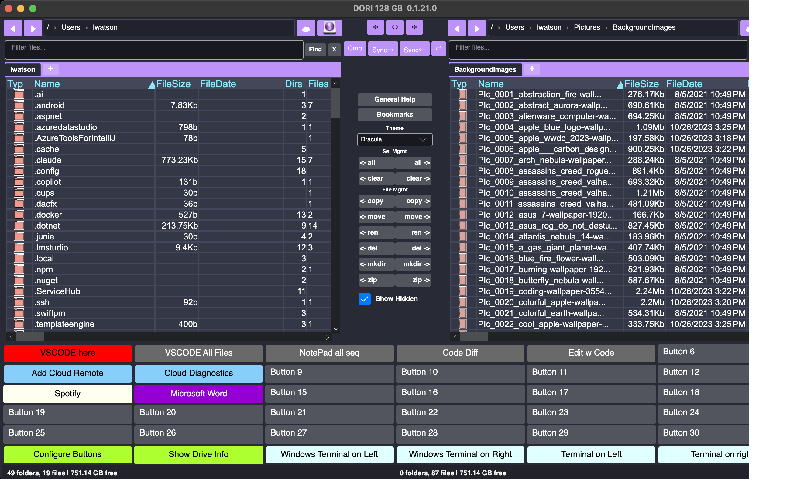

**Nord theme**

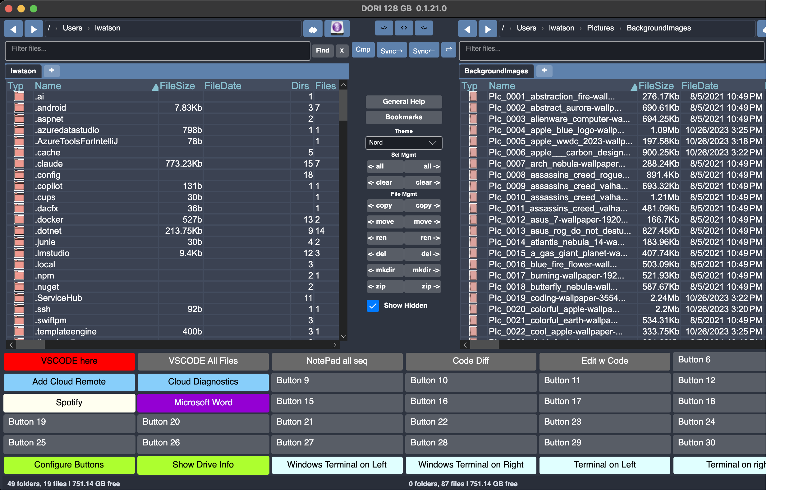

**Solarized Dark theme**

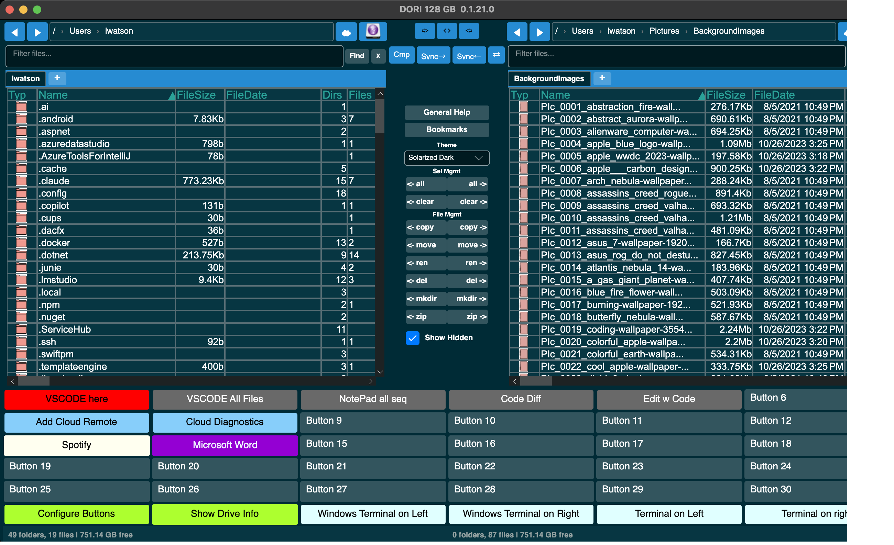

**Solarized Light theme**

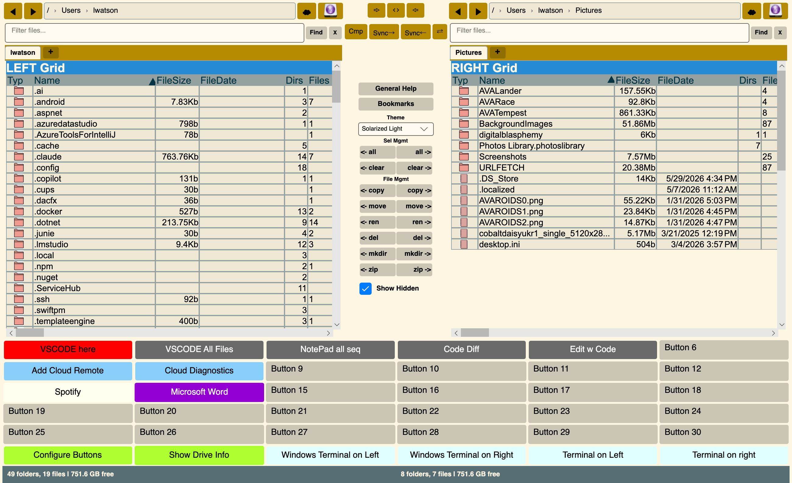

### Dialogs

**General Help**

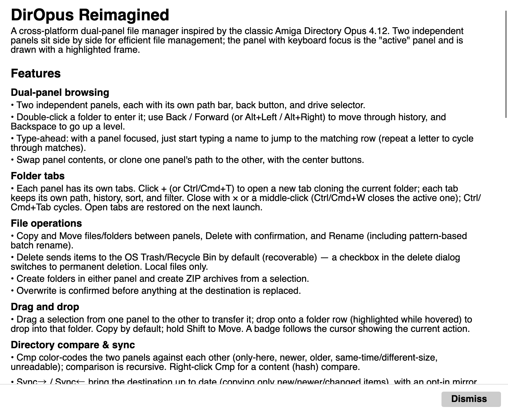

**Bookmarks**

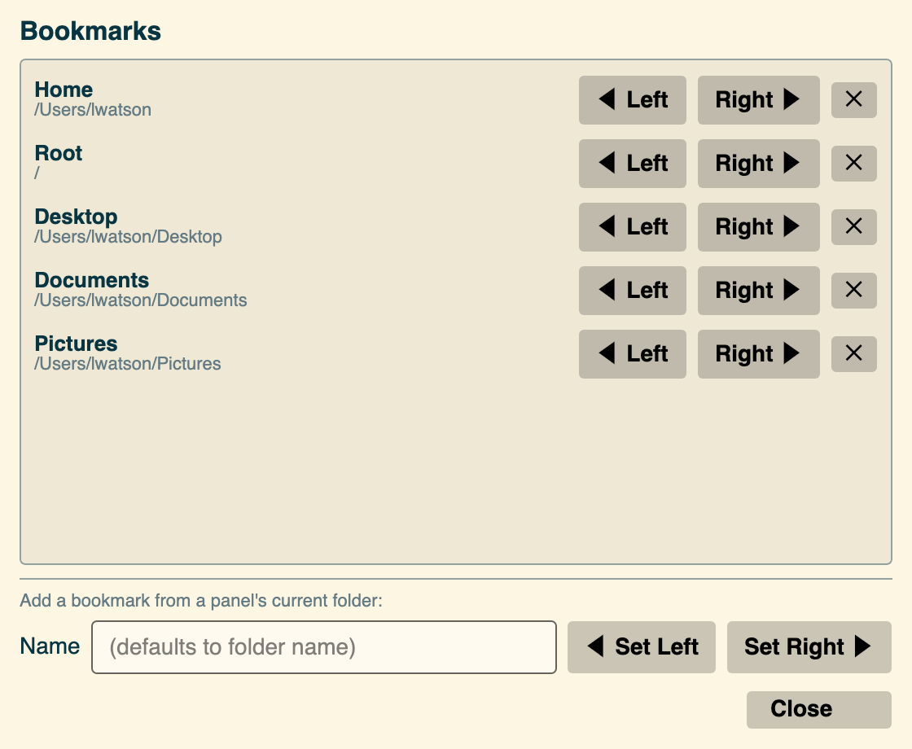

**Drive Information**

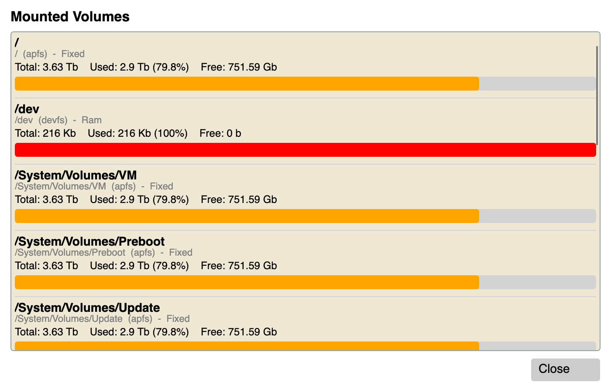

### Button & app configuration

**Command Buttons**

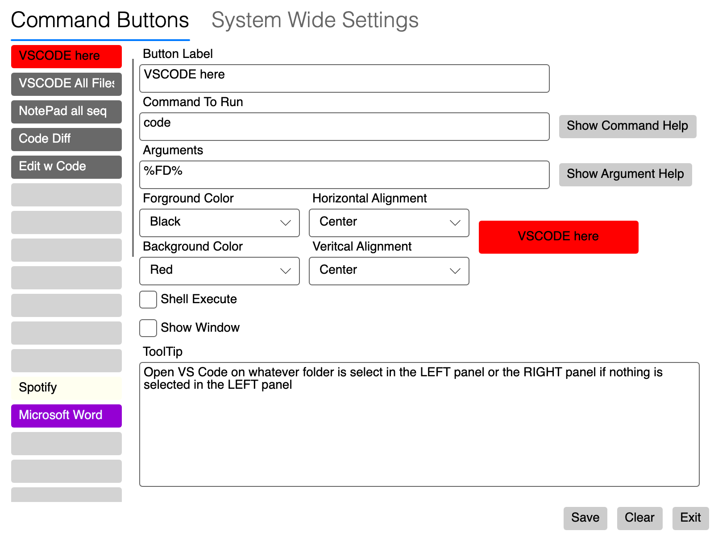

**System Wide Settings**

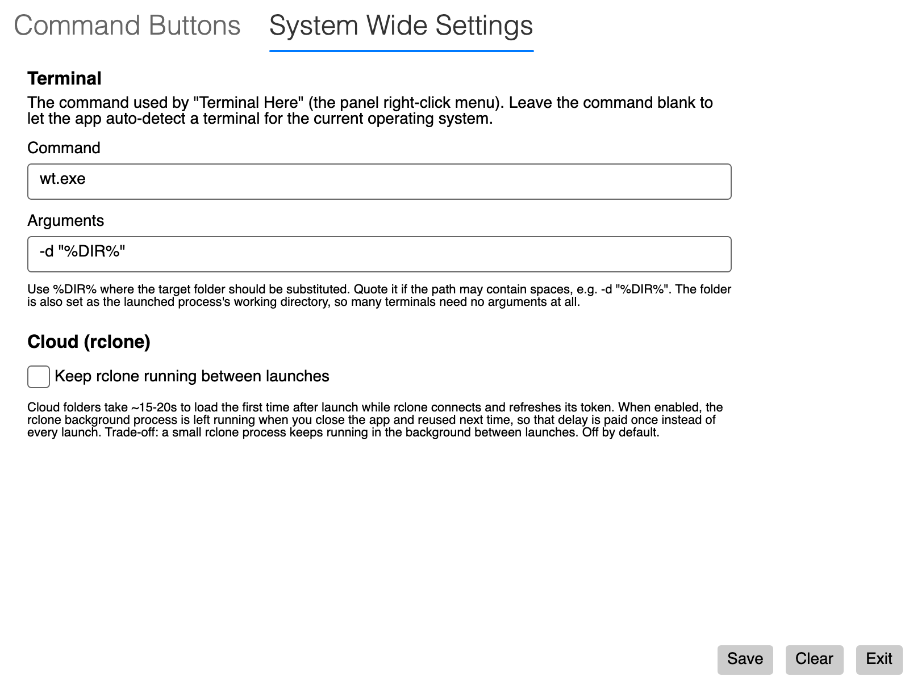

### Cloud storage (rclone)

**Add a remote — Google Drive**

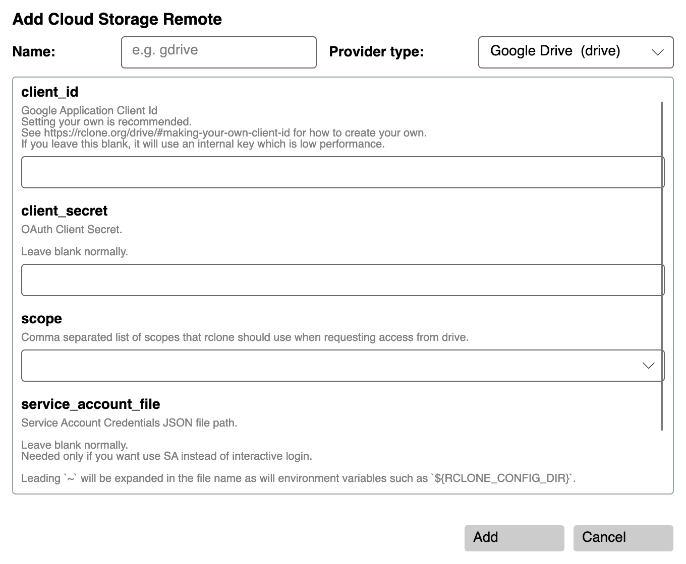

**Add a remote — Dropbox**

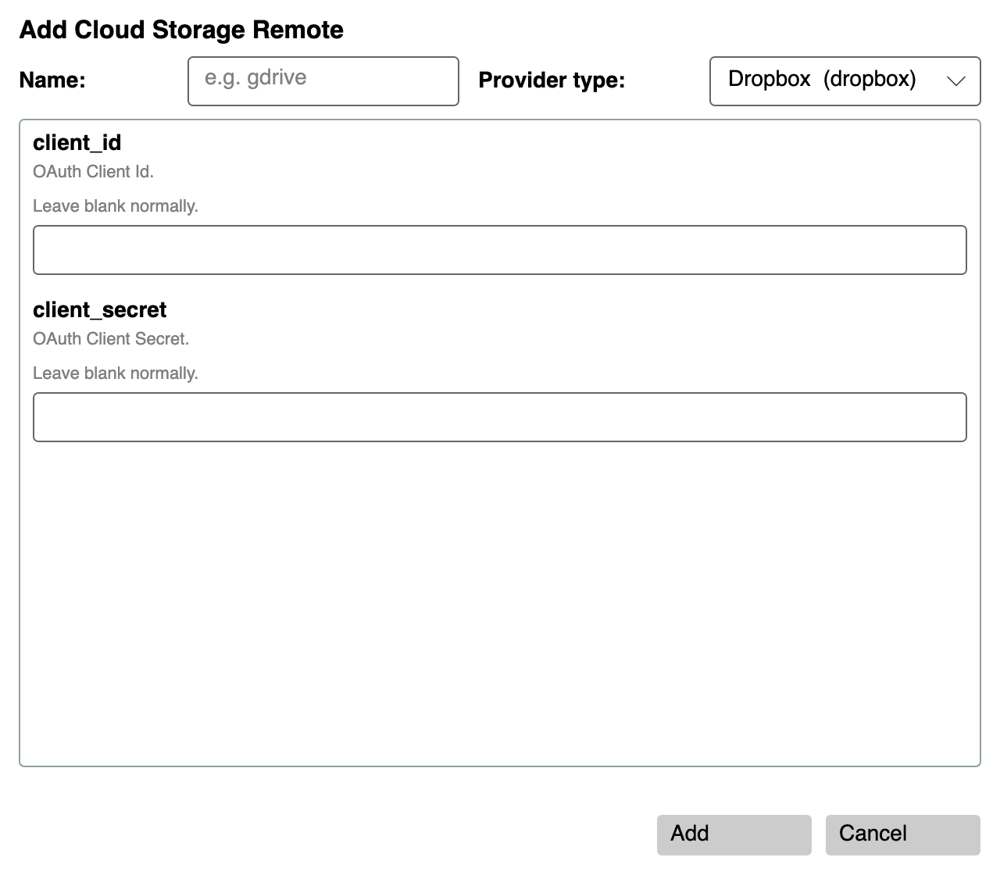

**Add a remote — AWS S3**

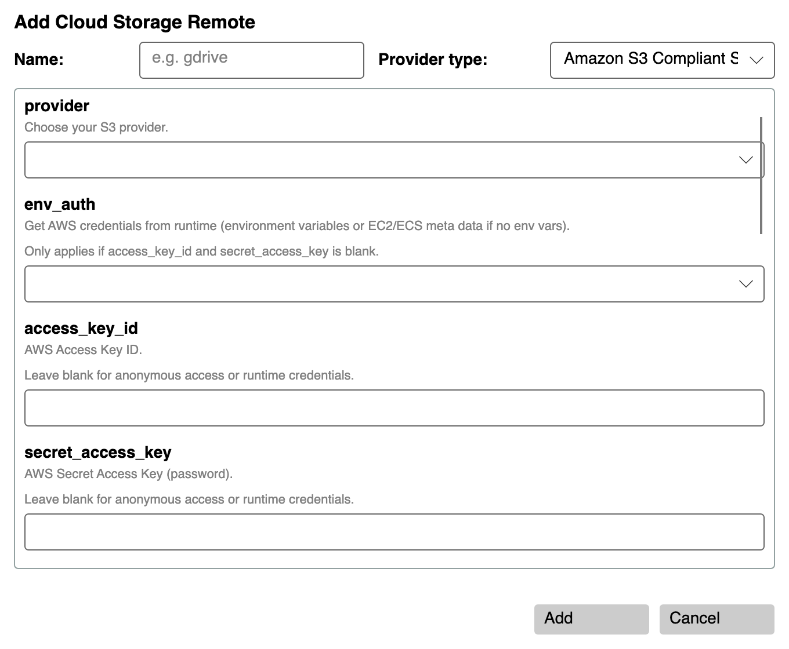

**rclone Diagnostics**

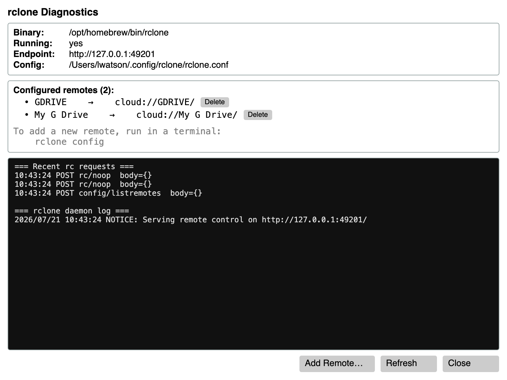

Arguments Parameters

The `<Args> </Args>` parameter can contain the following entries

* Any text that you want to pass to the command line

* `%FD%` - Full Path of the file or folder selected in the Left or Right Panel Left Panel is searched first

* `%AF%` - All Files in the Left or Right Panel Left Panel is searched first. Each argument is separated by a space

* `%LAF%` - All Files in the Left or Right Panel . Each argument is separated by a space Left panel is searched first

* `%RF1%` - Full Path of the file selected in the Right Panel

* `%LF1%` - Full Path of the file selected in the Left Panel

    Note That the above two parameters are usable together in a buttons definition
    To allow handing a file from each panel to a command. For example a diff command
    as shown in the above example configuration file

* `%RPAF%` - Full Path All Files in the Right Panel . Each argument is separated by a space

* `%LPAF%` - Full Path All Files in the Left Panel . Each argument is separated by a space

* `%LPATH%` - Full Path of what is currently being shown in the LEFT Panel

* `%RPATH%` - Full Path of what is currently being shown in the RIGHT Panel


The `<Action></Action>` Parameter needs to be the actual command that you want to execute on clicking the button. 
The Parsed ARGS from the above parameters will be appended to the command line.

The `<Name></Name>` Parameter is the name of the button. It is used to identify the button in the configuration file.
There are 36 buttons available in the interface numbered 1 to 36. The buttons are numbered from left to right
top to bottom. The first button is LPButton1 and the last button is LPButton36.

The `<Content></Content>` Parameter is the text that will appear on the button itself.

**Built-in command tokens** — if `<Content>` is set to one of the special tokens below, the button opens a built-in dialog instead of launching an external command. `<Action>`, `<Args>`, `<Shell>`, and `<Window>` are ignored for these buttons.

| Token | What the button does |
|---|---|
| `%BUTTONCONFIG%` | Opens the button-definition editor for the 36 action buttons |
| `%DRIVEINFO%` | Opens the Drive Information dialog showing mounted volumes |
| `%RCLONEDIAG%` | Opens the rclone Diagnostics dialog — binary location, daemon state, configured remotes (with Delete), live log, and an **Install rclone** button if it's missing |
| `%RCLONECONFIG%` | Opens the Add Remote dialog directly — pick a provider, fill the form (OAuth handled automatically for Google Drive / OneDrive / Dropbox / etc.), and the new remote appears as `cloud://<name>/` in any panel |

Example — adding a button that opens the cloud configuration dialog:

```xml
<Button>
    <Name>LPButton3</Name>
    <Content>%RCLONECONFIG%</Content>
    <Background>DarkGreen</Background>
    <Foreground>White</Foreground>
    <ToolTip>Add a new cloud storage remote</ToolTip>
</Button>
```

The `<Background></Background>` Parameter is the background color of the button

The `<Foreground></Foreground>` Parameter is the foreground color of the button

The `<HorizontalAlignment></HorizontalAlignment>` Parameter is the horizontal alignment of the text on the button
Valid values are Left, Center, Right

The `<VerticalAlignment></VerticalAlignment>` Parameter is the vertical alignment of the text on the button
Valid values are Top, Center, Bottom

The `<Margin></Margin>` Parameter is the margin around the button. The values are in the order Left, Top, Right, Bottom

The `<Shell></Shell>` Parameter is a boolean value that indicates whether the command should be executed in a shell or not
valid values are True or False

The `<Window></Window>` Parameter is a boolean value that indicates whether the command should be executed in a new window or not
valid values are True or False

The `<ToolTip></ToolTip>` Parameter is the text that will appear when the mouse hovers over the button for a few seconds


### Bookmarks

Quick-access folders are managed through **Bookmarks** (the button in the center panel), which
replaced the older fixed grid of drive-preset buttons. The dialog lists your saved folders and lets
you send any of them to the **Left** or **Right** panel, add the current folder of either panel, or
remove entries — all following the active Light/Dark theme.

Bookmarks are stored in `BOOKMARKS.MD`, a plain-Markdown file kept beside the executable so it ships
with the app and is easy to hand-edit. Each bookmark is one list line:

```markdown
- [Name](path)
```

`path` may be a local path or a `cloud://<remote>/<path>` URI. On first run (when `BOOKMARKS.MD` has
no entries) the app seeds a default set — **Home, Root, Desktop, Documents, Pictures** — with paths
resolved for the current user and OS.

### Terminal

**Terminal Here** on a panel's right-click menu opens a terminal in that panel's current folder. The
terminal it launches is controlled by the `<Terminal>` element in `Configuration.xml`, which you can
edit directly or from the **System Wide Settings** tab of the Button Configuration dialog:

```xml
<Terminal>
  <Command>wt.exe</Command>
  <Args>-d "%DIR%"</Args>
</Terminal>
```

- `<Command>` is the terminal executable. Leave it **blank** to let the app auto-detect a terminal
  for the current OS (Windows Terminal → PowerShell → cmd on Windows, Terminal.app on macOS, and the
  first available emulator on Linux).
- `<Args>` are passed to that command, with `%DIR%` replaced by the target folder. Quote it
  (`-d "%DIR%"`) if the path may contain spaces. The folder is also set as the launched process's
  working directory, so many terminals need no arguments at all.
- If a configured command can't start (e.g. it isn't installed), the app falls back to auto-detection.

This is separate from any terminal-launching command buttons you may have configured — those still
work exactly as before.

## Cloud Storage (rclone)

DORI can browse cloud storage — Google Drive, OneDrive, Dropbox, S3, Box, and ~40 other providers — through [rclone](https://rclone.org/). Remotes you've configured in rclone appear as `cloud://<remote>/<path>` URIs you can type into any panel's path box just like a local path.

### How it works

- DORI launches a local `rclone rcd` daemon on a random `127.0.0.1` port and talks to it over HTTP with a per-session user/password.
- All provider authentication (OAuth tokens, API keys) is stored by rclone in its own config file — DORI never handles credentials directly.
- The daemon is launched lazily on the first cloud-path operation and shut down automatically when DORI closes.

### Step 1 — Install rclone

You have three broad choices for getting rclone onto your system. Pick whichever is easiest — DORI uses whichever it finds first on your PATH, falling back to its own private copy.

1. **Install system-wide with a package manager** (recommended if you already use one).
2. **Download the official binary** from rclone.org and put it on your PATH manually.
3. **Let DORI download it for you** — opens the rclone Diagnostics dialog and click **Install rclone**. DORI downloads the pinned version (v1.68.2) into its private data directory. No admin rights needed; doesn't affect anything else on your system.

#### macOS

| Method | Command |
|---|---|
| Homebrew | `brew install rclone` |
| MacPorts | `sudo port install rclone` |
| Official install script | `curl https://rclone.org/install.sh \| sudo bash` |
| Manual zip | [rclone.org/downloads](https://rclone.org/downloads/) → pick `rclone-vX.Y.Z-osx-amd64.zip` (Intel) or `rclone-vX.Y.Z-osx-arm64.zip` (Apple Silicon), extract, move `rclone` to `/usr/local/bin/` and `chmod +x` it |

#### Linux

| Distribution | Command |
|---|---|
| Debian / Ubuntu | `sudo apt install rclone` |
| Fedora / RHEL | `sudo dnf install rclone` |
| Arch / Manjaro | `sudo pacman -S rclone` |
| openSUSE | `sudo zypper install rclone` |
| Alpine | `sudo apk add rclone` |
| Any distro (always current) | `curl https://rclone.org/install.sh \| sudo bash` |
| Snap | `sudo snap install rclone` |

Distro packages can lag the upstream release by months. If you need the latest features, use the official install script or manual zip.

#### Windows

| Method | Command |
|---|---|
| winget | `winget install Rclone.Rclone` |
| Chocolatey | `choco install rclone` |
| Scoop | `scoop install rclone` |
| Manual zip | [rclone.org/downloads](https://rclone.org/downloads/) → pick `rclone-vX.Y.Z-windows-amd64.zip` (64-bit) or `rclone-vX.Y.Z-windows-386.zip` (32-bit), extract, copy `rclone.exe` somewhere on your `PATH` (e.g. `C:\Program Files\rclone\`) |

After a manual install on Windows, add the folder containing `rclone.exe` to your `PATH` environment variable (System Properties → Advanced → Environment Variables), then open a fresh terminal so it picks up the change.

#### Verify the install

Open a terminal and run:

```bash
rclone version
```

You should see output like `rclone v1.68.2` — the exact version will depend on your install method. If you get "command not found", either rclone isn't installed, or its location isn't on your `PATH`. DORI will still work in that case — just use the **Install rclone** button in the Diagnostics dialog to get a private copy.

#### Using DORI's built-in installer

If you skip the above and open a panel with `cloud://…`, DORI will throw a clear error telling you rclone isn't installed. Open the diagnostics dialog (bind any button's `<Content>` to `%RCLONEDIAG%`), click **Install rclone**, and watch the progress bar — DORI downloads the pinned binary for your OS and architecture, extracts it, and sets it up. Subsequent cloud operations work normally.

### Step 2 — Configure a remote

Remotes are set up interactively by running `rclone config` in a terminal. Each remote gets a short name — that's what you'll use in DORI as `cloud://<name>/`.

**Example: Google Drive**

```bash
rclone config
```

Answer the prompts:

| Prompt | Answer |
|---|---|
| e/n/d/r/c/s/q | `n` — new remote |
| name | `gdrive` (or whatever you'd like; remember, it's case-sensitive) |
| Storage | select **Google Drive** (usually `drive`) |
| client_id | blank (uses rclone's default) |
| client_secret | blank |
| scope | `1` (full access) |
| service_account_file | blank |
| Edit advanced config? | `n` |
| Use auto config? | `y` — opens your browser for OAuth |
| Configure this as a Shared Drive? | `n` (unless it is) |
| Keep this "gdrive" remote? | `y` |
| e/n/d/r/c/s/q | `q` |

rclone's [Google Drive docs](https://rclone.org/drive/) cover edge cases like shared drives, service accounts, and using your own OAuth client ID.

**Other providers:** rclone supports a long list. Setup follows the same shape — run `rclone config`, pick the provider, fill in provider-specific details. See:
- [OneDrive](https://rclone.org/onedrive/)
- [Dropbox](https://rclone.org/dropbox/)
- [S3](https://rclone.org/s3/)
- [Full provider list](https://rclone.org/overview/)

### Step 3 — Where `rclone.conf` lives

| Platform | Default config path |
|---|---|
| macOS / Linux | `~/.config/rclone/rclone.conf` |
| Windows | `%APPDATA%\rclone\rclone.conf` |

If `RCLONE_CONFIG` is set, rclone uses that path instead. DORI's embedded binary reads the same file as a system-installed rclone, so setup done with either works everywhere.

**If you only have DORI's embedded rclone** (no system install), invoke it directly:
- macOS: `~/Library/Application\ Support/DirOpusReImagined/rclone/rclone config`
- Linux: `~/.local/share/DirOpusReImagined/rclone/rclone config`
- Windows: `%LOCALAPPDATA%\DirOpusReImagined\rclone\rclone.exe config`

The Diagnostics dialog's **Binary** row shows the exact path on your system.

### Step 4 — Access cloud resources in DORI

1. Click either panel's path text box.
2. Type `cloud://<remote-name>/` — the leading part must match the remote name in `rclone.conf` exactly (case-sensitive).
3. Press Enter.
4. Browse as you would any local folder — double-click directories, use breadcrumbs, use the back button.

**Examples:**

| URI | Opens |
|---|---|
| `cloud://gdrive/` | Root of the `gdrive` remote |
| `cloud://gdrive/Photos/2024` | A subfolder |
| `cloud://dropbox/Work` | A different remote |
| `cloud://onedrive/Documents` | Yet another |

You can have one panel on a local path and the other on a cloud path — copy between them as usual.

### Diagnostics dialog

Bind a custom button in `Configuration.xml` to open the rclone diagnostics dialog:

```xml
<Button>
    <Name>LPButton1</Name>
    <Content>%RCLONEDIAG%</Content>
    <Background>DarkBlue</Background>
    <Foreground>White</Foreground>
</Button>
```

(`%RCLONEDIAG%` is a built-in command — any button whose `<Content>` is exactly that string triggers the dialog.)

The dialog shows:
- **Binary** — path to rclone (or "not installed"), with an Install button when missing
- **Running** / **Endpoint** — daemon state and local URL
- **Config** — path to `rclone.conf`
- **Configured remotes** — list of remote names with their `cloud://` URIs, read via rclone's `config/listremotes` API
- **Recent rc requests** — last 100 outgoing API calls (method, endpoint, JSON body, any error responses)
- **rclone daemon log** — live stdout/stderr from the background `rclone rcd` process

### Caveats

- Cloud listings have network latency — expect ~200 ms–1 s per directory hop depending on provider. The UI stays responsive during these calls.
- Subdirectory count and directory size columns are blank for cloud entries to avoid a round-trip per row (local entries still show these).
- Double-clicking a cloud **file** to launch it is not yet supported (download-to-temp-and-launch is planned).
- ZIP archive creation targeting a cloud path is not yet supported.

### Supported cloud providers & their settings

DORI browses any storage backend that [rclone](https://rclone.org/) supports — the **Add Cloud Remote** dialog lists them and prompts for exactly the fields shown below. The list is generated from the bundled rclone version; newer rclone builds may add more.

Notes that apply throughout:

- **OAuth providers** (Google Drive, OneDrive, Dropbox, Box, pCloud, and others): just click **Add** and sign in through your browser — there are no fields to fill. `client_id` / `client_secret` are optional and only needed if you want to use your own API application instead of rclone's.
- Fields marked **(required)** must be supplied; the rest are optional (sensible defaults, or credentials that can come from the environment).
- Only the common setup fields are shown here. Every backend has additional **advanced** options — see each provider's linked rclone docs page for the full reference.
- After adding a remote named `myremote`, open it in any panel with `cloud://myremote/`.

#### 1Fichier

rclone type: `fichier` · docs: https://rclone.org/fichier/

**Settings:**

- `api_key` — Your API Key, get it from https://1fichier.com/console/params.pl.

#### Akamai NetStorage

rclone type: `netstorage` · docs: https://rclone.org/netstorage/

**Settings:**

- `host` **(required)** — Domain+path of NetStorage host to connect to.
- `account` **(required)** — Set the NetStorage account name
- `secret` **(required)** — Set the NetStorage account secret/G2O key for authentication.

#### Amazon S3 & S3-compatible (AWS, Wasabi, MinIO, Cloudflare R2, DigitalOcean Spaces, Backblaze, Ceph, and many more)

rclone type: `s3` · docs: https://rclone.org/s3/

**Settings:**

- `provider` — Choose your S3 provider.
- `env_auth` — Get AWS credentials from runtime (environment variables or EC2/ECS meta data if no env vars).
- `access_key_id` — AWS Access Key ID.
- `secret_access_key` — AWS Secret Access Key (password).
- `region` — Region to connect to.
- `endpoint` — Endpoint for S3 API.
- `location_constraint` — Location constraint - must be set to match the Region.
- `acl` — Canned ACL used when creating buckets and storing or copying objects.
- `server_side_encryption` — The server-side encryption algorithm used when storing this object in S3.
- `sse_kms_key_id` — If using KMS ID you must provide the ARN of Key.
- `storage_class` — The storage class to use when storing new objects in S3.
- `ibm_api_key` — IBM API Key to be used to obtain IAM token
- `ibm_resource_instance_id` — IBM service instance id
- `bucket_object_lock_enabled` — Enable Object Lock when creating new buckets.

#### Backblaze B2

rclone type: `b2` · docs: https://rclone.org/b2/

**Settings:**

- `account` **(required)** — Account ID or Application Key ID.
- `key` **(required)** — Application Key.
- `hard_delete` — Permanently delete files on remote removal, otherwise hide files.

#### Box

rclone type: `box` · docs: https://rclone.org/box/

**Authentication:** OAuth — click **Add** and sign in through your browser (no fields required). `client_id` / `client_secret` optional.

**Settings:**

- `client_id` — OAuth Client Id.
- `client_secret` — OAuth Client Secret.
- `box_config_file` — Box App config.json location
- `access_token` — Box App Primary Access Token
- `box_sub_type` — null

#### Citrix Sharefile

rclone type: `sharefile` · docs: https://rclone.org/sharefile/

**Authentication:** OAuth — click **Add** and sign in through your browser (no fields required). `client_id` / `client_secret` optional.

**Settings:**

- `client_id` — OAuth Client Id.
- `client_secret` — OAuth Client Secret.
- `root_folder_id` — ID of the root folder.

#### Cloudinary

rclone type: `cloudinary` · docs: https://rclone.org/cloudinary/

**Settings:**

- `cloud_name` **(required)** — Cloudinary Environment Name
- `api_key` **(required)** — Cloudinary API Key
- `api_secret` **(required)** — Cloudinary API Secret
- `upload_prefix` — Specify the API endpoint for environments out of the US
- `upload_preset` — Upload Preset to select asset manipulation on upload

#### DOI datasets

rclone type: `doi` · docs: https://rclone.org/doi/

**Settings:**

- `doi` **(required)** — The DOI or the doi.org URL.

#### Drime

rclone type: `drime` · docs: https://rclone.org/drime/

**Settings:**

- `access_token` — API Access token

#### Dropbox

rclone type: `dropbox` · docs: https://rclone.org/dropbox/

**Authentication:** OAuth — click **Add** and sign in through your browser (no fields required). `client_id` / `client_secret` optional.

**Settings:**

- `client_id` — OAuth Client Id.
- `client_secret` — OAuth Client Secret.

#### Enterprise File Fabric

rclone type: `filefabric` · docs: https://rclone.org/filefabric/

**Authentication:** OAuth — click **Add** and sign in through your browser (no fields required). `client_id` / `client_secret` optional.

**Settings:**

- `url` **(required)** — URL of the Enterprise File Fabric to connect to.
- `root_folder_id` — ID of the root folder.
- `permanent_token` — Permanent Authentication Token.

#### FileLu Cloud Storage

rclone type: `filelu` · docs: https://rclone.org/filelu/

**Settings:**

- `key` **(required)** — Your FileLu Rclone key from My Account

#### Filen

rclone type: `filen` · docs: https://rclone.org/filen/

**Settings:**

- `email` **(required)** — Email of your Filen account
- `password` **(required)** — Password of your Filen account
- `api_key` **(required)** — API Key for your Filen account

#### Files.com

rclone type: `filescom` · docs: https://rclone.org/filescom/

**Settings:**

- `site` — Your site subdomain (e.g. mysite) or custom domain (e.g. myfiles.customdomain.com).
- `username` — The username used to authenticate with Files.com.
- `password` — The password used to authenticate with Files.com.

#### FTP

rclone type: `ftp` · docs: https://rclone.org/ftp/

**Settings:**

- `host` **(required)** — FTP host to connect to.
- `user` — FTP username.
- `port` — FTP port number.
- `pass` — FTP password.
- `tls` — Use Implicit FTPS (FTP over TLS).
- `explicit_tls` — Use Explicit FTPS (FTP over TLS).

#### Gofile

rclone type: `gofile` · docs: https://rclone.org/gofile/

**Settings:**

- `access_token` — API Access token

#### Google Cloud Storage (this is not Google Drive)

rclone type: `google cloud storage` · docs: https://rclone.org/googlecloudstorage/

**Authentication:** OAuth — click **Add** and sign in through your browser (no fields required). `client_id` / `client_secret` optional.

**Settings:**

- `client_id` — OAuth Client Id.
- `client_secret` — OAuth Client Secret.
- `project_number` — Project number.
- `user_project` — User project.
- `service_account_file` — Service Account Credentials JSON file path.
- `anonymous` — Access public buckets and objects without credentials.
- `object_acl` — Access Control List for new objects.
- `bucket_acl` — Access Control List for new buckets.
- `bucket_policy_only` — Access checks should use bucket-level IAM policies.
- `location` — Location for the newly created buckets.
- `storage_class` — The storage class to use when storing objects in Google Cloud Storage.
- `env_auth` — Get GCP IAM credentials from runtime (environment variables or instance meta data if no env vars).

#### Google Drive

rclone type: `drive` · docs: https://rclone.org/drive/

**Authentication:** OAuth — click **Add** and sign in through your browser (no fields required). `client_id` / `client_secret` optional.

**Settings:**

- `client_id` — Google Application Client Id
- `client_secret` — OAuth Client Secret.
- `scope` — Comma separated list of scopes that rclone should use when requesting access from drive.
- `service_account_file` — Service Account Credentials JSON file path.

#### Google Photos

rclone type: `google photos` · docs: https://rclone.org/googlephotos/

**Authentication:** OAuth — click **Add** and sign in through your browser (no fields required). `client_id` / `client_secret` optional.

**Settings:**

- `client_id` — OAuth Client Id.
- `client_secret` — OAuth Client Secret.
- `read_only` — Set to make the Google Photos backend read only.

#### Hadoop distributed file system

rclone type: `hdfs` · docs: https://rclone.org/hdfs/

**Settings:**

- `namenode` **(required)** — Hadoop name nodes and ports.
- `username` — Hadoop user name.

#### HiDrive

rclone type: `hidrive` · docs: https://rclone.org/hidrive/

**Authentication:** OAuth — click **Add** and sign in through your browser (no fields required). `client_id` / `client_secret` optional.

**Settings:**

- `client_id` — OAuth Client Id.
- `client_secret` — OAuth Client Secret.
- `scope_access` — Access permissions that rclone should use when requesting access from HiDrive.

#### HTTP

rclone type: `http` · docs: https://rclone.org/http/

**Settings:**

- `url` **(required)** — URL of HTTP host to connect to.
- `no_escape` — Do not escape URL metacharacters in path names.

#### Huawei Drive

rclone type: `huaweidrive` · docs: https://rclone.org/huaweidrive/

**Authentication:** OAuth — click **Add** and sign in through your browser (no fields required). `client_id` / `client_secret` optional.

**Settings:**

- `client_id` — OAuth Client Id.
- `client_secret` — OAuth Client Secret.

#### iCloud Drive and Photos

rclone type: `iclouddrive` · docs: https://rclone.org/iclouddrive/

**Settings:**

- `service` **(required)** — iCloud service to use.
- `apple_id` **(required)** — Apple ID.
- `password` **(required)** — Password.

#### ImageKit.io

rclone type: `imagekit` · docs: https://rclone.org/imagekit/

**Settings:**

- `endpoint` **(required)** — You can find your ImageKit.io URL endpoint in your [dashboard](https://imagekit.io/dashboard/developer/api-keys)
- `public_key` **(required)** — You can find your ImageKit.io public key in your [dashboard](https://imagekit.io/dashboard/developer/api-keys)
- `private_key` **(required)** — You can find your ImageKit.io private key in your [dashboard](https://imagekit.io/dashboard/developer/api-keys)

#### Internet Archive

rclone type: `internetarchive` · docs: https://rclone.org/internetarchive/

**Settings:**

- `access_key_id` — IAS3 Access Key.
- `secret_access_key` — IAS3 Secret Key (password).
- `item_derive` — Whether to trigger derive on the IA item or not. If set to false, the item will not be derived by IA upon upload.

#### Internxt Drive

rclone type: `internxt` · docs: https://rclone.org/internxt/

**Settings:**

- `email` **(required)** — Email of your Internxt account.
- `pass` **(required)** — Password.

#### Jottacloud

rclone type: `jottacloud` · docs: https://rclone.org/jottacloud/

**Authentication:** OAuth — click **Add** and sign in through your browser (no fields required). `client_id` / `client_secret` optional.

**Settings:**

- `client_id` — OAuth Client Id.
- `client_secret` — OAuth Client Secret.

#### Koofr, Digi Storage and other Koofr-compatible storage providers

rclone type: `koofr` · docs: https://rclone.org/koofr/

**Settings:**

- `provider` — Choose your storage provider.
- `endpoint` **(required)** — The Koofr API endpoint to use.
- `user` **(required)** — Your user name.
- `password` **(required)** — Your password for rclone generate one at https://app.koofr.net/app/admin/preferences/password.
- `password` **(required)** — Your password for rclone generate one at https://storage.rcs-rds.ro/app/admin/preferences/password.
- `password` **(required)** — Your password for rclone (generate one at your service's settings page).

#### Linkbox

rclone type: `linkbox` · docs: https://rclone.org/linkbox/

**Authentication:** OAuth — click **Add** and sign in through your browser (no fields required). `client_id` / `client_secret` optional.

**Settings:**

- `token` **(required)** — Token from https://www.linkbox.to/admin/account
- `email` **(required)** — Email for login
- `password` **(required)** — Password for login

#### Mail.ru Cloud

rclone type: `mailru` · docs: https://rclone.org/mailru/

**Authentication:** OAuth — click **Add** and sign in through your browser (no fields required). `client_id` / `client_secret` optional.

**Settings:**

- `client_id` — OAuth Client Id.
- `client_secret` — OAuth Client Secret.
- `user` **(required)** — User name (usually email).
- `pass` **(required)** — Password.
- `speedup_enable` — Skip full upload if there is another file with same data hash.

#### Mega

rclone type: `mega` · docs: https://rclone.org/mega/

**Settings:**

- `user` **(required)** — User name.
- `pass` **(required)** — Password.
- `2fa` — The 2FA code of your MEGA account if the account is set up with one

#### Microsoft Azure Blob Storage

rclone type: `azureblob` · docs: https://rclone.org/azureblob/

**Settings:**

- `account` — Azure Storage Account Name.
- `env_auth` — Read credentials from runtime (environment variables, CLI or MSI).
- `key` — Storage Account Shared Key.
- `sas_url` — SAS URL for container level access only.
- `connection_string` — Storage Connection String.
- `tenant` — ID of the service principal's tenant. Also called its directory ID.
- `client_id` — The ID of the client in use.
- `client_secret` — One of the service principal's client secrets
- `client_certificate_path` — Path to a PEM or PKCS12 certificate file including the private key.
- `client_certificate_password` — Password for the certificate file (optional).

#### Microsoft Azure Files

rclone type: `azurefiles` · docs: https://rclone.org/azurefiles/

**Settings:**

- `account` — Azure Storage Account Name.
- `env_auth` — Read credentials from runtime (environment variables, CLI or MSI).
- `key` — Storage Account Shared Key.
- `sas_url` — SAS URL for container level access only.
- `connection_string` — Storage Connection String.
- `tenant` — ID of the service principal's tenant. Also called its directory ID.
- `client_id` — The ID of the client in use.
- `client_secret` — One of the service principal's client secrets
- `client_certificate_path` — Path to a PEM or PKCS12 certificate file including the private key.
- `client_certificate_password` — Password for the certificate file (optional).
- `share_name` — Azure Files Share Name.

#### Microsoft OneDrive

rclone type: `onedrive` · docs: https://rclone.org/onedrive/

**Authentication:** OAuth — click **Add** and sign in through your browser (no fields required). `client_id` / `client_secret` optional.

**Settings:**

- `client_id` — OAuth Client Id.
- `client_secret` — OAuth Client Secret.
- `region` — Choose national cloud region for OneDrive.
- `tenant` — ID of the service principal's tenant. Also called its directory ID.

#### OpenDrive

rclone type: `opendrive` · docs: https://rclone.org/opendrive/

**Settings:**

- `username` **(required)** — Username.
- `password` **(required)** — Password.

#### OpenStack Swift (Rackspace Cloud Files, Blomp Cloud Storage, Memset Memstore, OVH)

rclone type: `swift` · docs: https://rclone.org/swift/

**Settings:**

- `env_auth` — Get swift credentials from environment variables in standard OpenStack form.
- `user` — User name to log in (OS_USERNAME).
- `key` — API key or password (OS_PASSWORD).
- `auth` — Authentication URL for server (OS_AUTH_URL).
- `user_id` — User ID to log in - optional - most swift systems use user and leave this blank (v3 auth) (OS_USER_ID).
- `domain` — User domain - optional (v3 auth) (OS_USER_DOMAIN_NAME)
- `tenant` — Tenant name - optional for v1 auth, this or tenant_id required otherwise (OS_TENANT_NAME or OS_PROJECT_NAME).
- `tenant_id` — Tenant ID - optional for v1 auth, this or tenant required otherwise (OS_TENANT_ID).
- `tenant_domain` — Tenant domain - optional (v3 auth) (OS_PROJECT_DOMAIN_NAME).
- `region` — Region name - optional (OS_REGION_NAME).
- `storage_url` — Storage URL - optional (OS_STORAGE_URL).
- `auth_token` — Auth Token from alternate authentication - optional (OS_AUTH_TOKEN).
- `application_credential_id` — Application Credential ID (OS_APPLICATION_CREDENTIAL_ID).
- `application_credential_name` — Application Credential Name (OS_APPLICATION_CREDENTIAL_NAME).
- `application_credential_secret` — Application Credential Secret (OS_APPLICATION_CREDENTIAL_SECRET).
- `auth_version` — AuthVersion - optional - set to (1,2,3) if your auth URL has no version (ST_AUTH_VERSION).
- `endpoint_type` — Endpoint type to choose from the service catalogue (OS_ENDPOINT_TYPE).
- `storage_policy` — The storage policy to use when creating a new container.

#### Oracle Cloud Infrastructure Object Storage

rclone type: `oracleobjectstorage` · docs: https://rclone.org/oracleobjectstorage/

**Settings:**

- `provider` **(required)** — Choose your Auth Provider
- `namespace` **(required)** — Object storage namespace
- `compartment` — Specify compartment OCID, if you need to list buckets.
- `region` **(required)** — Object storage Region
- `endpoint` — Endpoint for Object storage API.
- `config_file` — Path to OCI config file
- `config_profile` — Profile name inside the oci config file

#### Pcloud

rclone type: `pcloud` · docs: https://rclone.org/pcloud/

**Authentication:** OAuth — click **Add** and sign in through your browser (no fields required). `client_id` / `client_secret` optional.

**Settings:**

- `client_id` — OAuth Client Id.
- `client_secret` — OAuth Client Secret.

#### PikPak

rclone type: `pikpak` · docs: https://rclone.org/pikpak/

**Settings:**

- `user` **(required)** — Pikpak username.
- `pass` **(required)** — Pikpak password.

#### Pixeldrain Filesystem

rclone type: `pixeldrain` · docs: https://rclone.org/pixeldrain/

**Settings:**

- `api_key` — API key for your pixeldrain account.
- `root_folder_id` — Root of the filesystem to use.

#### premiumize.me

rclone type: `premiumizeme` · docs: https://rclone.org/premiumizeme/

**Authentication:** OAuth — click **Add** and sign in through your browser (no fields required). `client_id` / `client_secret` optional.

**Settings:**

- `client_id` — OAuth Client Id.
- `client_secret` — OAuth Client Secret.

#### Proton Drive

rclone type: `protondrive` · docs: https://rclone.org/protondrive/

**Settings:**

- `username` **(required)** — The username of your proton account
- `password` **(required)** — The password of your proton account.
- `2fa` — The 2FA code
- `otp_secret_key` — The OTP secret key

#### Put.io

rclone type: `putio` · docs: https://rclone.org/putio/

**Authentication:** OAuth — click **Add** and sign in through your browser (no fields required). `client_id` / `client_secret` optional.

**Settings:**

- `client_id` — OAuth Client Id.
- `client_secret` — OAuth Client Secret.

#### QingCloud Object Storage

rclone type: `qingstor` · docs: https://rclone.org/qingstor/

**Settings:**

- `env_auth` — Get QingStor credentials from runtime.
- `access_key_id` — QingStor Access Key ID.
- `secret_access_key` — QingStor Secret Access Key (password).
- `endpoint` — Enter an endpoint URL to connection QingStor API.
- `zone` — Zone to connect to.

#### Quatrix by Maytech

rclone type: `quatrix` · docs: https://rclone.org/quatrix/

**Settings:**

- `api_key` **(required)** — API key for accessing Quatrix account
- `host` **(required)** — Host name of Quatrix account

#### seafile

rclone type: `seafile` · docs: https://rclone.org/seafile/

**Settings:**

- `url` **(required)** — URL of seafile host to connect to.
- `user` **(required)** — User name (usually email address).
- `pass` — Password.
- `2fa` — Two-factor authentication ('true' if the account has 2FA enabled).
- `library` — Name of the library.
- `library_key` — Library password (for encrypted libraries only).

#### Shade FS

rclone type: `shade` · docs: https://rclone.org/shade/

**Authentication:** OAuth — click **Add** and sign in through your browser (no fields required). `client_id` / `client_secret` optional.

**Settings:**

- `drive_id` **(required)** — The ID of your drive, see this in the drive settings. Individual rclone configs must be made per drive.
- `api_key` **(required)** — An API key for your account.

#### Sia Decentralized Cloud

rclone type: `sia` · docs: https://rclone.org/sia/

**Settings:**

- `api_url` — Sia daemon API URL, like http://sia.daemon.host:9980.
- `api_password` — Sia Daemon API Password.

#### SMB / CIFS

rclone type: `smb` · docs: https://rclone.org/smb/

**Settings:**

- `host` **(required)** — SMB server hostname to connect to.
- `user` — SMB username.
- `port` — SMB port number.
- `pass` — SMB password.
- `domain` — Domain name for NTLM authentication.
- `spn` — Service principal name.
- `use_kerberos` — Use Kerberos authentication.

#### SSH/SFTP

rclone type: `sftp` · docs: https://rclone.org/sftp/

**Settings:**

- `host` **(required)** — SSH host to connect to.
- `user` — SSH username.
- `port` — SSH port number.
- `pass` — SSH password, leave blank to use ssh-agent.
- `key_pem` — Raw PEM-encoded private key.
- `key_file` — Path to PEM-encoded private key file.
- `key_file_pass` — The passphrase to decrypt the PEM-encoded private key file.
- `pubkey` — SSH public certificate for public certificate based authentication.
- `pubkey_file` — Optional path to public key file.
- `key_use_agent` — When set forces the usage of the ssh-agent.
- `use_insecure_cipher` — Enable the use of insecure ciphers and key exchange methods.
- `disable_hashcheck` — Disable the execution of SSH commands to determine if remote file hashing is available.
- `ssh` — Path and arguments to external ssh binary.

#### Storj Decentralized Cloud Storage

rclone type: `storj` · docs: https://rclone.org/storj/

**Settings:**

- `provider` — Choose an authentication method.
- `access_grant` — Access grant.
- `satellite_address` — Satellite address.
- `api_key` — API key.
- `passphrase` — Encryption passphrase.

#### Sugarsync

rclone type: `sugarsync` · docs: https://rclone.org/sugarsync/

**Settings:**

- `app_id` — Sugarsync App ID.
- `access_key_id` — Sugarsync Access Key ID.
- `private_access_key` — Sugarsync Private Access Key.
- `hard_delete` — Permanently delete files if true

#### Uloz.to

rclone type: `ulozto` · docs: https://rclone.org/ulozto/

**Settings:**

- `app_token` — The application token identifying the app. An app API key can be either found in the API
- `username` — The username of the principal to operate as.
- `password` — The password for the user.

#### WebDAV

rclone type: `webdav` · docs: https://rclone.org/webdav/

**Settings:**

- `url` **(required)** — URL of http host to connect to.
- `vendor` — Name of the WebDAV site/service/software you are using.
- `user` — User name.
- `pass` — Password.
- `bearer_token` — Bearer token instead of user/pass (e.g. a Macaroon).

#### Yandex Disk

rclone type: `yandex` · docs: https://rclone.org/yandex/

**Authentication:** OAuth — click **Add** and sign in through your browser (no fields required). `client_id` / `client_secret` optional.

**Settings:**

- `client_id` — OAuth Client Id.
- `client_secret` — OAuth Client Secret.

#### Zoho

rclone type: `zoho` · docs: https://rclone.org/zoho/

**Authentication:** OAuth — click **Add** and sign in through your browser (no fields required). `client_id` / `client_secret` optional.

**Settings:**

- `client_id` — OAuth Client Id.
- `client_secret` — OAuth Client Secret.
- `region` — Zoho region to connect to.

## Building

### Prerequisites

- [.NET 8.0 SDK](https://dotnet.microsoft.com/download/dotnet/8.0) or later

Verify your installation:

```bash
dotnet --version
```

### Clone the Repository

```bash
git clone https://github.com/Harlock123/DirOpusReImagined.git
cd DirOpusReImagined
```

### Build

```bash
dotnet build
```

The compiled output will be in `bin/Debug/net8.0/`.

### Run

```bash
dotnet run
```

Or run the compiled binary directly:

```bash
./bin/Debug/net8.0/DirOpusReImagined
```

On Windows:

```cmd
bin\Debug\net8.0\DirOpusReImagined.exe
```

### Publish All Platforms (Single-File Executables)

Build scripts are included that produce self-contained, single-file executables for all 6 supported platforms. No .NET runtime needed on the target machine.

**On macOS/Linux:**
```bash
./publish-all.sh
```

**On Windows (PowerShell):**
```powershell
.\publish-all.ps1
```

Output goes to `publish/<platform>/`:

| Platform | Runtime ID | Output |
|---|---|---|
| Windows Intel/AMD 64-bit | `win-x64` | `publish/win-x64/DirOpusReImagined.exe` |
| Windows Intel/AMD 32-bit | `win-x86` | `publish/win-x86/DirOpusReImagined.exe` |
| Windows ARM | `win-arm64` | `publish/win-arm64/DirOpusReImagined.exe` |
| macOS Intel | `osx-x64` | `publish/osx-x64/DirOpusReImagined` |
| macOS Apple Silicon | `osx-arm64` | `publish/osx-arm64/DirOpusReImagined` |
| Linux Intel/AMD | `linux-x64` | `publish/linux-x64/DirOpusReImagined` |
| Linux ARM | `linux-arm64` | `publish/linux-arm64/DirOpusReImagined` |

The `publish-all.sh` and `publish-all.ps1` scripts also produce per-platform zip files in `dist/` suitable for attaching to a GitHub release (`DirOpusReImagined-<version>-<rid>.zip`).

### Publish a Single Platform

To build for just one platform:

```bash
dotnet publish -c Release -r <runtime-id> --self-contained true \
    -p:PublishSingleFile=true \
    -p:IncludeNativeLibrariesForSelfExtract=true \
    -p:EnableCompressionInSingleFile=true \
    -o publish/<runtime-id>
```

Replace `<runtime-id>` with one of: `win-x64`, `win-x86`, `win-arm64`, `osx-x64`, `osx-arm64`, `linux-x64`, `linux-arm64`.

### Configuration

Make sure `Configuration.xml` is in the same directory as the executable when running. The application looks for it in the following order:

1. The current working directory
2. Platform-specific locations:
   - **Linux/Unix**: `~/.config/dori/Configuration.xml`
   - **macOS**: `~/Library/Application Support/dori/Configuration.xml`
   - **Windows**: `%APPDATA%\dori\Configuration.xml`

The `Assets` folder (containing button icons) must also be present alongside the executable.

### Opening in an IDE

- **JetBrains Rider**: Open `DirOpusReImagined.sln`
- **Visual Studio**: Open `DirOpusReImagined.sln`
- **VS Code**: Open the project folder and install the C# Dev Kit extension

## Changelog

Notable changes, most recent first. Dates reflect when the work was implemented.

### 0.1.19.0 (2026-07-22) — UNC / network share copy fix
- **Copying to a Windows network share now actually writes to the share** — copy or move to a UNC path (`\\SERVER\SHARE\FOLDER`) reported success but nothing arrived, and a second attempt claimed files would be overwritten even though the share was empty. The panel paths were being run through a blind "collapse double backslashes" cleanup that ate the UNC prefix itself, turning `\\SERVER\SHARE\FOLDER` into `\SERVER\SHARE\FOLDER` — which Windows resolves against the *current drive*. The transfer then silently created and filled `C:\SERVER\SHARE\FOLDER` on the local disk, and the "already exists" check read back from that same wrong location. Separator cleanup now preserves a leading UNC prefix (both `\\server\share` and `//server/share` forms) everywhere it is applied: transfers, the `%LPATH%`/`%RPATH%` button tokens, terminal launching, config start paths, and double-click launching of executables.
  - *If you hit this before upgrading*, the files that appeared to vanish are most likely sitting in `C:\SERVER\SHARE\FOLDER\` (substituting your own server and share names). Recover them from there, then delete the stray tree.
- **Unreachable destinations now fail loudly** — a transfer whose destination folder does not exist stops with a "Destination unavailable" message instead of creating the folder and reporting success. Previously any malformed or unmounted destination path would be brought into existence on the fly, which is what let the UNC bug look like it had worked. Applies to local destinations only, so a slow cloud backend can't false-negative and block a valid transfer.

### 0.1.18.0 (2026-07-21) — Keep rclone warm (optional)
- **Keep rclone running between launches** — a new opt-in setting in the button configuration dialog's **System Wide Settings** tab. When enabled, the background rclone daemon is left running when you close the app and re-attached on the next launch, so cloud folders skip the ~15-20s cold-start on every launch and load instantly instead. **Off by default** (it leaves a small rclone process running between launches).
- **Orphaned-daemon cleanup (always on)** — the app now records the rclone daemons it spawns and, on every startup, kills any that leaked from a previous crash or force-quit (sparing the one it will re-attach to when keep-warm is enabled). Only daemons this app started are ever touched. The daemon now logs to a file so a kept-warm process keeps logging after the app closes.

### 0.1.17.0 (2026-07-21) — Screenshot capture
- **Screenshot hotkey** — press **Ctrl+Shift+P** (**Cmd+Shift+P** on macOS) on any screen or dialog to render that window to a **PNG**. A save dialog opens pre-filled with a descriptive, spaces-free default filename derived from the window (e.g. `DORI_Main_Screen`, `Rename_Selected_File_s`), capped at 40 characters. Registered app-wide via a single tunnelling handler, so it works on every window and modal dialog — including inside the file grid and text boxes — intended as an aid for building documentation.
- **Layout fixes** — the General Help text no longer clips under the vertical scrollbar, and the file panels no longer overrun the button panel at the bottom (the per-panel tab bar height was not being accounted for when sizing the grids).
- **Click selection repaints immediately** — clicking a row now highlights it at once instead of waiting for the next mouse move; the panel was updating the selection without repainting the grid.
- **Cloud tab reliability** — a cloud folder restored from the previous session now loads on its own instead of sitting at "Loading…" until you navigate away and back. On a cold start the rclone daemon (and its OAuth token refresh) isn't ready when the tab first lists, so DORI now warms the client in the background and re-populates the panel once it's ready; the loading row also notes that the first cloud access can take ~20s, and the daemon-ready timeout was raised to 20s.

### 0.1.16.0 (2026-07-20) — Forward navigation, type-ahead & Trash
- **Forward navigation** — each panel now has a **Forward** button beside Back (and **Alt+←/Alt+→**), with per-tab history. A new navigation clears the forward stack, exactly like a web browser.
- **Type-ahead jump** — start typing a name in a focused panel to jump the cursor to the first matching row; repeating a letter cycles through matches. Layout-aware, resets after a short pause, and never interferes with the path/filter boxes.
- **Send to Trash** — deletes now go to the OS **trash / recycle bin** by default (recoverable), with a **"Move to Trash (recoverable)"** checkbox in the delete dialog to choose permanent deletion per-delete (remembered in `Configuration.xml`). Cross-platform: Windows Recycle Bin (`SHFileOperation`), macOS Finder Trash, and Linux `gio trash` with a freedesktop.org spec fallback. Applies to local files only — cloud deletes remain permanent.

### 0.1.15.0 (2026-07-20) — Folder tabs
- **Folder tabs per panel** — each side now has a tab bar above the file list. Open multiple folders per panel and switch between them; every tab keeps its own path, back-history, sort, and filter, all independent of the other tabs and the other panel.
- **New / close / switch** — the **＋** button opens a new tab cloning the current folder; close a tab with its **×** or a **middle-click** (the last tab can't be closed). Keyboard: **Ctrl/Cmd+T** new, **Ctrl/Cmd+W** close, **Ctrl/Cmd+Tab** (Shift for previous) or **Ctrl/Cmd+PageUp/PageDown** to cycle. Plain **Tab** still switches panels.
- **Persistence** — open tabs and the active tab are saved to `Configuration.xml` and restored on the next launch; paths that no longer resolve are dropped on load.

### 0.1.14.0 (2026-07-20) — Click-to-sort columns & named themes
- **Sort by clicking column headers** — click the **Name**, **Size**, or **Date** header to sort a panel by it; click again to reverse (an **▲/▼** marks the active column). **Right-click** a header for a menu that also sorts by **Type (extension)** and sets **Ascending/Descending**. Sorting is now **per-panel** and persists as you navigate; folders stay grouped first. Sorting runs on the typed underlying fields, so sizes order numerically and dates chronologically. The old Name/Size sort radios were retired in favor of the headers (reclaiming center-panel space).
- **Named themes** — in addition to Light/Dark/System, the Theme selector now offers **Dracula**, **Nord**, **Solarized Light**, and **Solarized Dark**. These are custom palettes layered on the existing semantic-token system (each inherits a light or dark base so standard controls stay consistent), and the choice persists like the others.

### 0.1.13.0 (2026-07-19) — Text/hex viewer & external tools on archived files
- **Text/Hex file viewer** — press **F3** (or right-click → **View**) to open a read-only viewer for the selected file. It auto-detects text vs binary, offers a Text ⇄ Hex toggle (offset · bytes · ASCII), honors BOMs for text, and caps large files at the first 256 KB with a truncation note. It reads through the provider layer, so it views files inside archives exactly like normal files.
- **Custom commands work on files inside archives** — external tools launched from the command buttons (e.g. "edit with VS Code") previously received an unusable `archive://…` path. Now the `%AF%`, `%LAF%`, `%LF1%`, `%RF1%`, `%LPAF%`, and `%RPAF%` tokens transparently **extract the archive entry to a temporary copy** and pass that real path to the tool. A one-time note explains that edits to the temp copy are not written back into the read-only archive; the temp folder is cleaned up on exit.

### 0.1.12.0 (2026-07-19) — Browse into archives
- **Browse archives like folders** — double-click a `.zip`, `.7z`, `.rar`, `.tar`, or `.tar.gz`/`.tgz` to open it in the panel and navigate its contents, including nested folders. Back/up steps out of the archive naturally.
- **Extract via the normal transfer pipeline** — copy or drag files and folders out of an archive to a normal folder; extraction reuses the existing progress dialog, cancel, and overwrite confirmation. Recursive folder extraction is supported.
- **Read-only by design** — writing *into* an archive (copy/move/drag in) is blocked up front with a clear message rather than failing partway; extract first, then modify.
- Built on a new `ArchiveFileProvider` behind the existing `IFileProvider`/`ProviderRegistry` abstraction (paths use an `archive://<file>!/<entry>` scheme), reading via the pure-managed **SharpCompress** library so it works on Windows, macOS, and Linux. Random-access formats (zip/7z/rar/tar) and compression-wrapped tarballs (gzip/bzip2) are both handled.

### 0.1.11.0 (2026-07-19) — Wildcard selection
- **Select / Deselect by pattern** — pick items by a wildcard or substring pattern (e.g. `*.jpg`, `proj*`, `report?`) instead of one at a time. Available from each panel's right-click menu ("Select by Pattern…", "Deselect by Pattern…") and via the orthodox **+** (select) and **-** (deselect) keys. A dialog collects the pattern and offers a **Files only** option to skip folders.
- **Invert selection** — flip the current selection with "Invert Selection" on the right-click menu or the **\*** key.
- Wildcard actions use the same matcher as the filter box and operate on the **displayed** rows, so they respect an active filter. The keys only fire while a file panel has focus, so typing in the path/filter boxes is unaffected, and each accepts both the number-pad and main-keyboard variants.

### 0.1.10.0 (2026-07-18) — Bookmarks, Open Terminal Here, Windows startup fix & center-panel declutter
- **Folder bookmarks** — a new **Bookmarks** button in the center panel opens a dialog that lists your saved folders and sends any one of them to the **Left** or **Right** panel (◀ Left / Right ▶). Bookmarks can be added from either panel's current folder (**◀ Set Left** / **Set Right ▶**) and removed inline. Everything persists to `BOOKMARKS.MD` beside the executable — a plain Markdown list (`- [Name](path)`) that ships with the app and is easy to hand-edit. The dialog follows the active Light/Dark theme.
- **Drive Presets replaced by Bookmarks** — the fixed grid of 10 drive-preset buttons was removed from the center panel to reduce clutter and stop it truncating on smaller displays. On first run (when `BOOKMARKS.MD` has no entries) the app synthesizes the same common presets as bookmarks — **Home, Root, Desktop, Documents, Pictures** — with paths resolved for the current user/OS, so nothing is lost. The stale `<DrivePresets>` sections and docs were removed from the config files and README.
- **Open Terminal Here** — a new **Terminal Here** entry on each panel's right-click menu opens a terminal in that panel's current folder (works on empty space too, so no need to activate the panel first). Cloud locations report a message instead of failing.
- **Cross-platform terminal detection** — with no configuration, the launcher picks a terminal per OS with no external helper process: Windows Terminal → PowerShell → cmd on Windows, Terminal.app on macOS, and the first available emulator on Linux (`x-terminal-emulator`, `gnome-terminal`, `konsole`, `xfce4-terminal`, `alacritty`, `kitty`, and more). A trailing-backslash quoting bug that broke Windows Terminal on paths like `C:\…\Folder\` was fixed by building arguments with `ArgumentList` and normalizing the path.
- **Configurable terminal + System Wide Settings tab** — a new `<Terminal>` element in `Configuration.xml` (`<Command>` + `<Args>`, with `%DIR%` substituted for the folder) overrides the terminal. It's editable from a new **System Wide Settings** tab added to the Button Configuration dialog. A configured command that can't start falls back to auto-detection.
- **Windows startup crash fixed** — the app threw at initialization in `MainWindow` when reading total physical memory. The `ComputerInfo` package shells out to `wmic`, which Microsoft has deprecated and removed from current Windows 11 builds, so the call failed to launch and the memory properties threw a type exception.
- **New cross-platform memory helper** — added `SystemInfo/PhysicalMemory.cs`, which reads true installed RAM through a native API per platform with no external process: `GlobalMemoryStatusEx` on Windows, `/proc/meminfo` on Linux, and `sysctlbyname("hw.memsize")` on macOS. It falls back to the .NET runtime's `GC.GetGCMemoryInfo()` and returns `0` on failure rather than throwing, so startup can no longer fail here.
- **Dependency removed** — dropped the `ComputerInfo` NuGet package entirely.
- **Sort order refreshes immediately** — switching the **Sort Options** between **Name** and **Size** now repopulates both file panels right away, matching the Show Hidden toggle. Previously the radios had no change handler, so the new sort order only took effect on the next unrelated refresh (navigation, toggling hidden, or a file operation).

### 0.1.9.0 (2026-07-17) — Light/Dark theming & General Help
- **Light / Dark / System theme** — a new **Theme** selector in the center panel switches the whole application between Light, Dark, and following the operating system. The choice is persisted to `Configuration.xml` and restored on the next launch. System mode tracks OS appearance changes live.
- **App-wide theming** — colors are driven by a central set of semantic tokens (with a curated Light and Dark value each) defined in `App.axaml`. The main window chrome, every dialog, and both Canvas-rendered file grids all switch together; standard controls adapt via Avalonia's Fluent theme.
- **Intelligible-by-design contrast** — file-row text color is computed per row from the actual row background (normal, selection, hover, drop target, and each compare state) using the WCAG relative-luminance formula, so text stays legible over any color in either theme without hand-tuning. This also fixed compare-row text always rendering dark.
- **General Help dialog** — a new **General Help** button in the center panel opens a scrollable reference enumerating the application's features and a full table of the keyboard navigation shortcuts, with a Dismiss button.
- **Center panel polish** — smaller section labels, the Sort **Name**/**Size** radios placed side by side, and a compact theme selector to reclaim vertical space.

### 0.1.8.0 (2026-07-17) — Keyboard-driven navigation & operations
- **Active panel** — the panel with keyboard focus is now the "active" panel and is drawn with a highlighted frame. Click a panel or press **Tab** to switch; keyboard operations act on the active panel.
- **Keyboard cursor & selection** — a keyboard cursor (the outlined row) moves with **↑/↓/PageUp/PageDown/Home/End** and scrolls into view. Explorer-style selection: plain arrows single-select, **Shift+**arrows extend a contiguous range from the anchor, **Ctrl/Cmd+**arrows move without selecting, **Space/Insert** toggle-and-advance, and **Ctrl/Cmd+A** selects all files. The status bar updates live as the selection changes.
- **Keyboard navigation** — **Enter** opens the cursor row (folders navigate in, files open/execute), **Backspace** goes up one directory level (history-aware, like the Back button), and **Tab** switches the active panel. These act only while a file panel has focus, so typing in the path and filter boxes is unaffected.
- **Keyboard file operations** — **F2** rename, **F5** copy, **F6** move, **F7** new folder, and **F8**/**Delete** delete, all targeting the active panel and reusing the existing dialogs (overwrite confirmation, transfer progress, delete confirmation, selection validation). Copy/Move always flow out of the active panel into the other, so Tab-then-F5 reverses the direction.

### 0.1.7.0 (2026-07-06) — Drag-and-drop, overwrite confirmation & dialog titles
- **Drag and drop** — drag the selected files/folders from one panel and drop them on the other to transfer them; drop **onto a folder row** (highlighted gold while hovered) to drop into that folder instead of the panel's current directory. **Copy** by default; hold **Shift** to **Move**. A multi-item selection drags as a set. Built on Avalonia's cross-platform drag/drop, so it works on Windows, macOS, and Linux, and reuses the same transfer pipeline as the Copy/Move buttons (progress, cancel, and local/cloud/cross-provider paths). Dropping a folder into itself or its own subtree, or back into the folder it already lives in, is refused. A floating **Copy/Move badge** follows the cursor during the drag so the current action (which flips as you hold/release Shift) is always visible. (Internal panel-to-panel only; dragging to/from the OS desktop is not included.)
- **Overwrite warning** — Copy, Move, and drag-and-drop now check the destination first and, if anything would be overwritten, ask for confirmation ("*N items already exist in the destination and will be overwritten. Copy anyway?*") before transferring. The existence check runs off the UI thread so it stays responsive for cloud targets.
- **Shift-to-Move fix** — holding Shift from the start of a drag now correctly begins a **Move** instead of doing nothing; the grid no longer blocks the drag when a modifier is held, and the drop's Copy/Move result matches the badge shown at release.
- **Read-only destination fix** — a drag-drop transfer could fail with "Read-only file system" when the drop panel's cached path was empty (the destination resolved to the filesystem root). Drops now resolve the destination from the panel's own path box — the same authoritative path the Copy/Move buttons use — and refuse to run against an empty base.
- **Move-overwrite fix** — a Move onto an existing file previously failed with "already exists" even after you confirmed the overwrite; Move now replaces the existing target (Copy already did), a directory move onto an existing folder merges the tree in file-by-file, and moving a file or folder onto itself is treated as a no-op so the existing-target cleanup can never delete the only copy.
- **Dialog titles** — message and confirmation dialogs now show a meaningful window title (e.g. *Error*, *Selection Required*, *Confirm Overwrite*, *Program Not Found*) instead of "MessageBox". The rclone "Delete remote?" prompt is now a real confirmation that actually cancels when you decline.

### 2026-06-17 — Recursive search & filter patterns
- **Recursive search** — a **Find** button on each panel's filter row opens a search window that recursively searches that panel's folder (local or cloud) for a name pattern. The pattern is a substring by default, or a wildcard (`*.jpg`, `report?`) when it contains `*`/`?`; options for match-case and including folders. The search runs off-thread with a live result count, current-folder status, and a **Cancel** button, and skips folders it can't read. Double-click a result to jump the panel to its folder.
- **Filter box now supports patterns** — the per-panel "Filter files…" box previously matched substrings only, so `*.jpg` matched nothing. It now uses the same matcher as search: wildcards (`*.jpg`, `report?`) when present, substring otherwise (`jpg` still works).
- **Right-panel layout fix** — corrected the panel width calculation that had drifted out of sync with the toolbar width, which was letting the right panel's clear-filter (X) button and scroll bar spill slightly past the window edge.

### 2026-06-15 — Inaccessible-folder handling & drive picker
- **Compare progress dialog** — a recursive (and especially content/cloud) compare now runs behind a small modal dialog with an animated progress bar, a live "current folder" line, and a **Cancel** button, instead of only changing the Cmp button to "…". (Also fixed a crash in the new dialog and the sync options dialog where their controls weren't being initialized.)
- **Content (hash) compare** — **right-click the Cmp button** for a menu offering *Quick compare* (name, size, time — the default left-click behavior) or *Content compare (hash)*. Content mode compares files by MD5 hash instead of size + timestamp, so a file edited and re-saved at the same size and time is correctly detected as changed. It's slower (it reads/hashes file contents); for cloud files it uses a server-side hash when the remote exposes one (e.g. Google Drive) and otherwise falls back to size + time for that file.
- **Content (hash) sync** — **right-click either Sync button** for *Quick sync* (the default left-click behavior) or *Content sync (hash)*. Content sync uses the same hash comparison to decide what to copy, so a content-identical file with only a newer timestamp is no longer recopied. The "never overwrite a newer destination" and opt-in mirror/delete rules are unchanged.
- **Two-way "newer wins" sync** — a new **⇄** button in the toolbar merges both panels in both directions: each file's newer version is copied to whichever side has the older (or missing) copy, recursively, and items present on only one side are copied to the other. Nothing is ever deleted, and files that exist on both sides with the same timestamp but different content are left untouched as conflicts. Left-click runs it; right-click offers a content (hash) variant.
- **Compare survives locked folders** — a recursive **Cmp** that hits a folder it can't read (permissions) no longer aborts with an error dialog. That folder is now colored **coral** and the rest of the comparison continues. The new color is documented in the Cmp button's legend tooltip, and one-way sync likewise skips any subfolder it can't read instead of failing the whole operation.
- **Drive / volume picker** — the drive button on each panel's path bar (to the right of the cloud button) now works: it lists the machine's ready drives and mounted volumes, and selecting one jumps that panel to its root. On Windows it shows drive letters; on macOS/Linux it shows `/` and real mounts (under `/Volumes`, `/media`, `/mnt`) while hiding synthetic system volumes.

### 2026-06-13 — Directory compare & sync
- **Compare panels** — a **Cmp** button color-codes the two panels against each other: green = only on this side, blue = newer, gray = older, khaki = same time but different size (or, for a folder, a subtree that differs). The comparison is **recursive** — a folder that looks identical at the top level but differs deep inside is flagged. Click **Cmp** again, or navigate, to clear.
- **One-way sync / mirror** — **Sync→** and **Sync←** buttons bring the destination panel up to date with the source. By default this copies only new, newer, and changed items and never overwrites a newer destination file; an options dialog adds an opt-in **mirror** mode that also deletes items existing only in the destination (with a permanent-deletion warning). Sync is **recursive and file-level**: it descends into shared folders and copies just the differing files rather than overwriting whole folders. It reuses the transfer progress dialog (current file, speed, ETA, cancel) and works for local, cloud, and cross-provider paths.
- **Cloud listing cache** — cloud directory listings are cached for 30 seconds, so revisiting a folder, hitting back, or refreshing after an operation is instant instead of re-fetching over the network. In-app changes (copy/move/delete/mkdir) clear the cache so your own edits show immediately.
- **Context-menu fix (macOS)** — the right-click menu on the file grid no longer flashes open and immediately closes; the grid now skips its canvas rebuild while the menu is showing.
- **Toolbar layout** — the Compare/Sync controls now sit on their own centered row in the middle column (below the panel-swap arrows) instead of overflowing the narrow nav strip and obscuring the right panel; the three buttons are sized and aligned consistently.

### 2026-06-12 — Cloud transfer progress, quick-pick remotes & listing fixes
- **Transfer progress dialog** — copy and move now run off the UI thread behind a progress window showing the current file, an overall progress bar, transfer speed, and ETA, with a **Cancel** button. Byte-level progress is reported across every path: local→local (a buffered counting stream), and cloud→cloud, cloud→local, and local→cloud (driven by rclone's async job with live `core/stats` polling, so the slow network leg reports real bytes instead of freezing).
- **Cloud remotes quick-pick** — a ☁ button on each panel's path bar lists the cloud remotes configured in rclone; selecting one navigates that panel straight to `cloud://<remote>/`, so there's no need to type the URI by hand. Includes friendly prompts when rclone isn't installed or no remotes are configured yet.
- **rclone crash fix (macOS)** — bumped the bundled rclone from `v1.68.2` to `v1.74.1` (older builds segfault during cgo on recent macOS). The binary resolver now smoke-tests rclone before using it and falls back to a working copy on your `PATH` instead of handing back one that crashes on every call.
- **Cloud listing reliability** — folders no longer intermittently disappear when browsing a remote: the filter baseline now captures the real listing rather than the transient "Loading…" placeholder from an async load. Folder/file ordering is now consistent regardless of how you navigated (folders first, then files by name — or by actual byte size in size mode, which previously sorted on the formatted size string). A transient `operations/list` failure now retries briefly and then surfaces a clear error instead of silently showing an empty folder.

### 2026-06-12 — Avalonia 11.3 upgrade & Linux HiDPI scaling
- Upgraded Avalonia from `11.0.0-preview4` to the current stable `11.3.17`, which scales natively to the desktop's fractional scaling on Linux (Wayland/X11) — the app now follows the system scale (e.g. 180%) correctly.
- Migrated the breaking APIs the upgrade introduced: `ItemsControl.Items` → `ItemsSource`, `Application.Current.Clipboard` → `TopLevel.Clipboard`, `PointerPoint.GetCurrentPoint(Visual)`, and `FluentTheme Mode` → `RequestedThemeVariant`.
- Removed the now-redundant `XamlNameReferenceGenerator` package (Avalonia 11.3 ships its own XAML name generator).
- Cleaned up stale `bin/Debug/net7.0` and duplicate asset entries from the project file.
- Note: an earlier same-day workaround that set `AVALONIA_GLOBAL_SCALE_FACTOR` from the system DPI was removed, as the upgrade makes it unnecessary (and it would otherwise double-scale).

### 2026-04-24 — Cloud "Add Remote"
- Added in-app "Add Remote" functionality and further rclone cloud integration enhancements.

### 2026-04-22 — rclone cloud provider & diagnostics
- Introduced an rclone-based cloud file provider and a diagnostics UI for inspecting remotes and logs.
- Expanded the README with detailed rclone installation instructions across macOS, Linux, and Windows.

### 2026-04-21 — File system abstraction & release packaging
- Introduced an extensible file system abstraction and updated file operations to use it.
- Added versioning and multi-platform release packaging to the publish scripts.

### 2026-04-19 — Navigation & path tools
- Added "Copy Path" and "Copy Full Path" context-menu options.
- Added a DriveInfo dialog for viewing mounted volumes and their details.
- Implemented path-history tracking for navigation, with cross-platform path handling and safer file execution.

### 2026-04-17 — Permissions & folder size
- Added a file permissions dialog with context-menu integration.
- Added a "Calculate Folder Size" context-menu option and improved file-execution checks.

### 2026-04-16 — Breadcrumb navigation
- Added breadcrumb navigation for the path bars and enhanced keyboard interactions.

### 2026-04-15 — Cross-platform config & publishing
- Centralized configuration/asset loading (`FindConfigurationFile`, `FindAssetsDirectory`) for cross-platform support.
- Added cross-platform publish scripts for single-file executables and documented their usage.
- Adjusted UI margins, heights, and padding for consistent spacing.

### 2026-04-13 — Cross-platform execution
- Refactored file handling for cross-platform execution and added human-readable file-size formatting.
- Expanded the README with setup, build, and deployment instructions.

